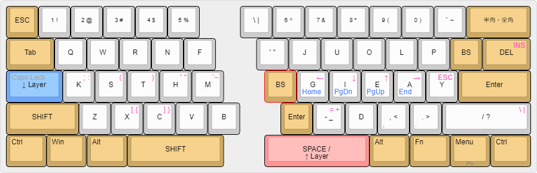

# Harmony layout

keyboard layout focusing English, programming and Japanese romaji simultaneous keying. qmk-firmware, autohotkey

- maintainer: Bottilabo 
- original repository: https://github.com/bottilabo/harmony-keyboard-layout


ハーモニーレイアウトは
- 英語入力
- プログラミング
- 同時打鍵による日本語のローマ字入力
を重視したキーボードレイアウトです。

QMK Firmware, AutoHotKey　による実装です。


## layout
```
q w r n f  j u o l p
k s t h m  g i e a y
z x c v b  - d , . /

Q W R N F  J U O L P
K S T H M  G I E A Y
Z X C V B  _ D < > ?
```

## English heatmap


## Japanese Romaji heatmap


## Harmony layout is ...
- free little finger from overwork
- optimized for English
- optimized for programming
- optimized for Japanese Romaji input using simultaneous keying
- optimized for bi-gram by same hand and different finger
- 50% same as QWERTY layout.


## ハーモニーレイアウトは
- 小指を過重労働から解放します。
- 英語入力に最適化されています。
- プログラミングに最適化されています。
- 同時打鍵による日本語のローマ字入力に最適化されています。
- 同じ手の異なる指でのbi-gramの入力に最適化されています。
- QWERTY配列と５０％が同じです。


# QMK Firmware

copy under qmk_firmware-files to your qmk_firmware directory.

Ex.
```
git clone https://github.com/bottilabo/harmony-keyboard-layout
cp -R harmony-keyboard-layout/qmk_firmware-files/ YOUR-QMK-DIR/ 
```

## crkbd Corne

```
sudo make crkbd:harmony6-crkbd:avrdude
```

## NumAtreus

```
sudo make NumAtreus:harmony6-numatreus:avrdude
```

## Yosino58

```
sudo make yosino58:harmony6-yosino58:avrdude
```

## Simuataneous keying Japanese Romaji input
See [https://github.com/bottilabo/qmk-romaji](https://github.com/bottilabo/qmk-romaji)

- English mode
`LOWER + RAISE + ,`

- Simultaneous Japanese Romaji mode
`LOWER + RAISE + .`


# AutoHotKey(Windows)
[AutoHotKey](https://www.autohotkey.com/)  
To handle combination of RightShift, you need to remap keycode NumpadDiv to RightShift.  
  
Just download and double click [NumpadDiv-RightShift.reg](AutoHotKey/NumpadDiv-RightShift.reg) to store registry information and restart computer.
This registry data is result of [remapkey.exe](https://kuchikomiwebsite.com/application/post-153).

You can uninstall by regedit.exe.
Just delete `HKEY_LOCAL_MACHINE\SYSTEM\CurrentControlSet\Control\Keyboard Layout\Scancode Map`.


## Happy Hacking Keyboard Pro

[hhkb pro.ahk](AutoHotKey/hhkb pro.ahk)

## MiSTEL Barocco


### MD600
[harmony6-mistel-barocco MD600.ahk](AutoHotKey/harmony6-mistel-barocco MD600.ahk)

### MD650L
[harmony6-mistel-barocco MD650.ahk](AutoHotKey/harmony6-mistel-barocco MD600.ahk)


